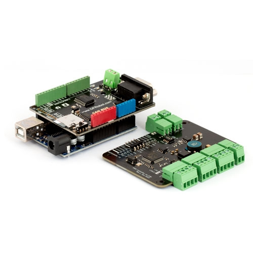

## SMC-00X Series
Updated on 24.01.04  
*업데이트 진행중*

### SMC-001

[구매 바로가기][1]

[메뉴얼 다운로드][2]
  
**문의하기**: *clare<k>.<k>robotmart<k>@<k>gmail<k>.<k>com<k>*

### Description
SMC-001 보드를 Arduino Uno 및 DFR CAN Shield를 이용하여 제어하는 예제코드 모음.  
해당 예제코트는 3200PPR을 기준으로 작성되었음 (모터 드라이버 분주율 조절 권장).

**지원 제어 종류**  
* Mode 0: 펄스기반 위치제어
* Mode 1: 지속 회전 속도제어
* Mode 2: 엔코더 기반 위치제어

### CAN Header File 준비
DFR CAN Shield 제공 라이브러리 [다운로드][3] or [mcp_can][4] 폴더 사용.  
"mcp_can" 폴더는 /Documents/Aruduino/libraries 폴더 내에 넣어놓기.

### Examples

| 제어 종류 |  예제 파일 | 엔코더 필요 여부 |
|-----------|:----------------------:|:----------------------:|
|**Mode 0** Basic| [examples/BasicDemo_Mode0](./examples/BasicDemo_Mode0) | X |
|**Mode 1** Basic| [examples/BasicDemo_Mode1](./examples/BasicDemo_Mode1) | X |
|**Mode 2** Basic| [examples/BasicDemo_Mode2](./examples/BasicDemo_Mode2) | O |
|**Mode 2** Tracking Position| [examples/TrackingPosition_Mode2](./examples/TrackingPosition_Mode2) | O |

[1]:https://www.motorbank.kr/goods/goods_list.php?cateCd=066
[2]:./SMC-001_RM.pdf
[3]:https://wiki.dfrobot.com/CAN-BUS_Shield_V2__SKU__DFR0370_#More
[4]:./mcp_can

